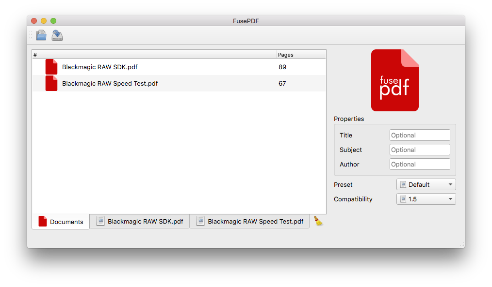

# FusePDF



[](https://github.com/nettstudio/fusepdf/releases/latest)

## Easily merge multiple PDF documents

FusePDF is an simple application with one purpose, to merge PDF documents.

Requires [Ghostscript](https://www.ghostscript.com/download/gsdnld.html) installed prior to usage.

## Changes

  * 1.2.0
    * Better UI
    * More options
    * Code cleanup (simplify)
    * Changed license to GPLv3
  * 1.1.0
    * Support for meta data (Tile/Subject/Author)
    * More options
    * Better UX
  * 1.0.0
    * First stable release

Written by Ole-André Rodlie for NettStudio AS.

Copyright (c) 2021 NettStudio AS. All rights reserved.

## Open Source

Build and package FusePDF from source (on Linux):
```
git clone https://github.com/nettstudio/fusepdf
cd fusepdf
mkdir build && cd build
qmake CONFIG+=release PREFIX=/usr .. && make
make INSTALL_ROOT=`pwd`/pkg install
```
Note that FusePDF requires Ghostscript (``gs``) available during runtime.