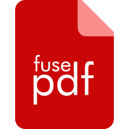

---
title: |
    {width=2.5in}  
    FusePDF 2.0.0
author: NettStudio AS
date: 'February 12, 2022'
mainfont: DejaVuSans.ttf
fontsize: 12pt
...

# Introduction

FusePDF is a simple cross-platform (Windows/macOS/Linux) application used for merging, splitting and exporting (PNG/TIFF RGB/CMYK) PDF pages and documents.

# License

Copyright &copy; 2021, 2022 [NettStudio AS](https://nettstudio.no). All rights reserved.

This program is free software; you can redistribute it and/or modify it under the terms of the GNU General Public License as published by the Free Software Foundation; either version 3 of the License, or (at your option) any later version.

This program is distributed in the hope that it will be useful, but WITHOUT ANY WARRANTY; without even the implied warranty of MERCHANTABILITY or FITNESS FOR A PARTICULAR PURPOSE. See the GNU General Public License for more details.

You should have received a copy of the GNU General Public License along with this program.  If not, see <http://www.gnu.org/licenses/>.

## Third-party

Windows releases of FusePDF includes various other open-source components.

### Qt

Copyright &copy; 2020 The Qt Company Ltd and other contributors.

Qt and the Qt logo are trademarks of The Qt Company Ltd.

This program is free software; you can redistribute it and/or modify it under the terms of the GNU General Public License as published by the Free Software Foundation; either version 3 of the License, or (at your option) any later version.

This program is distributed in the hope that it will be useful, but WITHOUT ANY WARRANTY; without even the implied warranty of MERCHANTABILITY or FITNESS FOR A PARTICULAR PURPOSE. See the GNU General Public License for more details.

You should have received a copy of the GNU General Public License along with this program.  If not, see <http://www.gnu.org/licenses/>.

### GPL Ghostscript

Copyright &copy; 2000-2021 Artifex Software, Inc.  All rights reserved.

This program is free software: you can redistribute it and/or modify it under the terms of the GNU Affero General Public License as published by the Free Software Foundation, either version 3 of the License, or (at your option) any later version.

This program is distributed in the hope that it will be useful, but WITHOUT ANY WARRANTY; without even the implied warranty of MERCHANTABILITY or FITNESS FOR A PARTICULAR PURPOSE.  See the GNU Affero General Public License for more details.

You should have received a copy of the GNU Affero General Public License along with this program.  If not, see <http://www.gnu.org/licenses/>.

